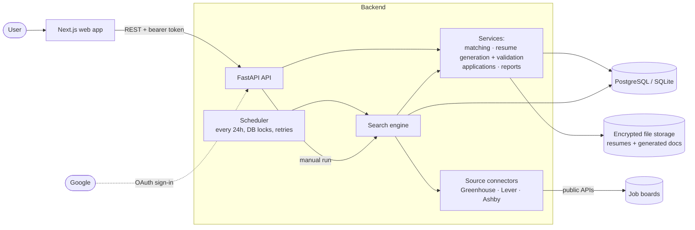

# JobPilot

A job-search assistant that **finds relevant jobs, tailors your resume to each one without inventing anything, and keeps an
auditable record of every application**. A scheduler repeats the search every 24 hours, even when no browser is open.

## Purpose

Job hunting is repetitive: searching many boards, re-checking the same listings, rewriting a resume per role, and losing
track of where you applied. JobPilot automates the repetitive parts and deliberately keeps *you* in control of the
consequential ones.

| It does | It will not |
|---|---|
| Search public company career feeds (Greenhouse, Lever, Ashby, Personio, SmartRecruiters, Workable, Recruitee) and Adzuna Switzerland, de-duplicating across runs; import jobs you paste from LinkedIn/Indeed/jobs.ch | Scrape sites that forbid it, or bypass logins/CAPTCHAs |
| Score each job against your keywords and preferences, and show *why* it matched or was excluded | Hide a job without giving a reason |
| Produce a job-specific ATS-friendly resume (DOCX/PDF) from **your own** resume facts, reworded by AI if you opt in | Add a skill, title, degree, employer, date or metric you don't already have |
| Judge job fit by meaning (AI, opt-in) on top of the rules-based filters | Send your name, email or phone to the AI, or use AI at all unless you turn it on |
| Prepare an application (or a manual-apply package) and wait for your approval | Submit anything by default, or mark "submitted" without confirmation |
| Keep an immutable history of every status change and resume version used | Ever apply to the same job twice |

## Solution design approach

Five principles drive the design; each maps to a concrete mechanism in the code.

1. **Your resume is the only source of facts.** The rules-based generator can only *select and reorder* facts from your
   reviewed resume. With AI on, Claude may also *reword* bullets, but its draft only supplies bullet text per role index
   (titles, employers and dates are copied from your resume by code), then must pass a deterministic validator (skills, roles,
   dates, degrees, numbers, and any job-text term absent from the resume) **and** a second AI audit for changed meaning. One retry
   with the errors as feedback; otherwise the safe rules-based version is used. Job text is untrusted data. → `services/resume_gen.py`, `ai_resume.py`
2. **Never duplicate, never fake.** One application per (user, job) is enforced by a DB constraint; a submission is *claimed*
   with an atomic compare-and-set so only one worker can send it; an unknown outcome is parked as "confirmation pending" and
   never auto-retried. → `services/applications.py`
3. **Honest data.** A job's posted date is only ever an original publication date; "last modified" is never promoted to it.
   Salaries are compared only when currency, period and gross/net basis are comparable. → `services/matching.py`, `ingest.py`
4. **Idempotent, restartable automation.** The scheduler takes a per-profile database lock, retries with exponential backoff,
   dead-letters repeated failures, and recovers stale runs; one failing source never stops the others. → `services/scheduler.py`
5. **Pluggable edges, transparent limits.** Job sources and submitters sit behind small interfaces. Anything not implemented
   (real employer submission, an LLM) is labelled as such rather than faked. → `connectors/`, `docs/integrations.md`

## Architecture



**One search run:** scheduler (or "Run now") → lock the profile → fetch each configured board → normalize and de-duplicate
→ apply hard filters and score → store new matches → (per automation setting) generate and validate a tailored resume and
prepare an application → write a daily report and notifications. Applications then wait for **your** approval.

**Automation levels** (Settings → Automation): *discovery only* · *prepare for review* (default) · *fill forms and request
approval* (reserved) · *auto-submit to authorized integrations* (explicit consent, revocable, pausable).

**AI (optional, off by default):** `LLM_PROVIDER=anthropic` + `ANTHROPIC_API_KEY` on the server, then each user opts in under
*Automation Settings*. Claude then (1) scores job fit by meaning and blends it with the rules score (hard filters still run first
and excluded jobs are never sent), (2) rewrites resume bullets per job, and (3) suggests search keywords. Calls are capped per run,
cached, and use structured outputs; the model has no tools and can never trigger an action. Only documented career facts and the
job text are sent: **no name, email, phone or links**. See [AI setup](docs/integrations.md#ai-provider-claude).

**Stack:** FastAPI, SQLAlchemy 2, Alembic, Pydantic · Next.js (App Router), Tailwind, React Hook Form + Zod · SQLite (dev) or
PostgreSQL · Fernet-encrypted file storage · Docker Compose · GitHub Actions.

## Quick start

Requires Python 3.12+ and Node 20+.

```bash
# backend
cd backend
python -m venv .venv && source .venv/bin/activate        # Windows: .venv\Scripts\activate
pip install -r requirements.txt
cp ../.env.example .env                                   # set SECRET_KEY
alembic upgrade head                                      # SQLite dev DB
uvicorn app.main:app --port 8000                          # API docs: http://localhost:8000/docs

# scheduler (second terminal, same venv)
python -m app.scheduler

# frontend (third terminal)
cd frontend && cp .env.example .env.local && npm install && npm run dev   # http://localhost:3000
```

> **Windows:** if PowerShell refuses to activate the venv ("running scripts is disabled"), skip activation and prefix
> commands with the venv's Python, e.g. `.venv\Scripts\python -m pytest -q`.

Then register, upload a resume, add a source in **Job Search Preferences** and run a search. Sources (no credentials unless
noted): Greenhouse `gitlab`, Lever `spotify`, Ashby `ramp`, and for Swiss/DACH employers Personio, SmartRecruiters, Workable
`huggingface`, Recruitee `bunq`, plus Adzuna Switzerland search (free key). **LinkedIn, Indeed and jobs.ch are deliberately not
searched automatically** (no permitted access); paste postings from them with **Add job manually**. See
[Switzerland / DACH sources](docs/integrations.md#switzerland--dach-sources).

**Docker:** `cp .env.example .env && docker compose up --build` starts Postgres, Redis, API, scheduler and web.

## Configuration
Everything is in [`.env.example`](.env.example) (each variable commented). Essentials: `SECRET_KEY` (signs sessions **and**
derives the file-encryption key), `DATABASE_URL`, `SANDBOX_MODE`, optional `GOOGLE_CLIENT_ID`/`GOOGLE_CLIENT_SECRET`
(see [Google sign-in setup](docs/integrations.md#google-sign-in-oauth-20--openid-connect)).

## Tests and CI
```bash
cd backend && pytest -q                      # 141 tests
cd frontend && npm run lint && npm run build
```
GitHub Actions runs four jobs on every push: backend tests (SQLite), frontend type-check + build, the same backend tests
**against a PostgreSQL 16 container** (with migration apply/drift/downgrade checks), and a **Docker Compose** build with an
API/web/scheduler smoke test. All were green on the latest commit. Job-board and Google traffic is mocked in tests; the
connectors were also checked once against the live Greenhouse, Lever and Ashby APIs.

## Documentation
[Architecture](docs/architecture.md) · [API](docs/api.md) · [Integrations](docs/integrations.md) ·
[Security & privacy](docs/security.md) · [Operations](docs/operations.md)

## Known limitations
1. **No real application submission.** The only submitter is a labelled **sandbox test double**. Employer-authorized APIs and
   browser form-filling are not implemented; everything else becomes a manual-apply package.
2. **AI is optional and only partly proven.** The AI paths are tested with a scripted fake model and a stub SDK client
   (141 tests), **not against the live Claude API** (no key was available). Run `python -m scripts.ai_smoke` with your key to check
   it. The strict fact-check can reject legitimate rewrites (it flags reworded text that uses words from the job posting that
   your resume lacks), in which case you get the rules-based resume. The resume parser itself is still heuristic and you review it.
3. **Not exercised:** Google sign-in against real Google (mock only), Celery/Redis workers, and any automated frontend/browser tests.
4. **Sources:** seven public career-feed APIs (board names entered by you) plus Adzuna (needs a free key; mocked tests only).
   No generic career-page crawler, and no LinkedIn/Indeed/jobs.ch connectors (not permitted; use manual import).
5. Not built: other OAuth providers, malware scanning, real email sending, the data-retention purge job, automated backups,
   a Redis-backed rate limiter, httpOnly-cookie sessions (the token is in `localStorage`), and a UI to resolve flagged
   possible duplicates.
